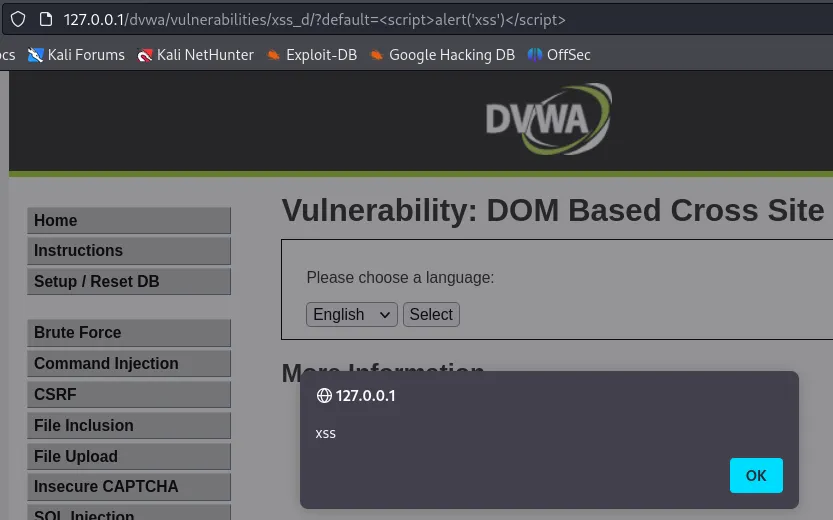
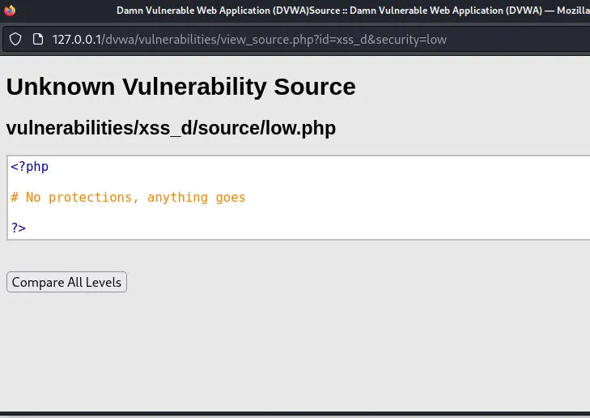
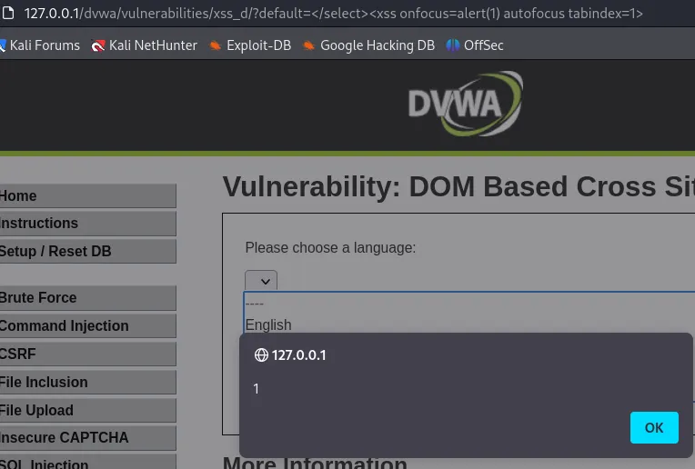
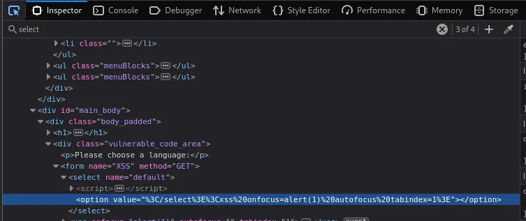
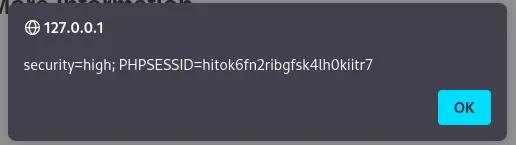
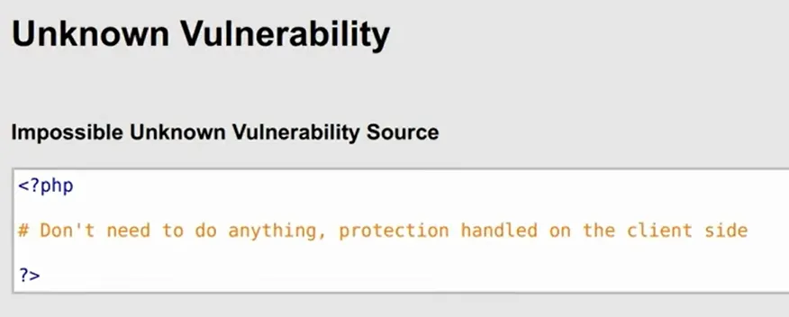

# Document Object Model (DOM) & Type-0 XSS (DOM-Based XSS)

## Document Object Model (DOM)
The **Document Object Model (DOM)** is a programming interface that represents an HTML document as a **hierarchical tree structure**, allowing programs (mainly JavaScript) to dynamically access, modify, and manipulate web page content.

---

## Type-0 XSS (DOM-Based XSS)
**Type-0 XSS**, also known as **DOM-Based XSS**, runs entirely on the **client side**.

- JavaScript modifies the DOM using **untrusted input** (such as URL parameters).
- The **server never sees the attack payload**.
- The **browser executes the malicious code**.

---

## Running DVWA (Damn Vulnerable Web Application)

To run DVWA, the following components are required:

1. **Web Server** – Displays DVWA pages in the browser  
2. **PHP** – Executes the DVWA application code  
3. **MySQL Database** – Stores users, sessions, and application data  
4. **DVWA Configuration** – Connects PHP to the database  

---

# Solving Type-0 XSS in DVWA

---

## I. Low Security Level

### Description
- No input validation is applied.
- All vulnerabilities are easy to exploit.
   

   

### Payload
http://127.0.0.1/dvwa/vulnerabilities/xss_d/?default=

### Payload Explanation
1. Browser loads the page  
2. JavaScript reads the `default` parameter from the URL  
3. JavaScript writes the value into the DOM  
4. Browser executes the `

### Payload Explanation
1. Browser loads the page  
2. Client-side JavaScript reads the `default` value from the URL fragment (`#`)  
3. JavaScript inserts the value directly into the DOM without sanitization  
4. Browser interprets and executes the `<script>` tag  
5. `alert(document.cookie)` is triggered  

### Mitigation
- Encode user input before inserting it into the DOM  
- Implement **Content Security Policy (CSP)**  
- Apply strict input validation  

---

## IV. Impossible Security Level

### Description
- Data taken from the URL is automatically encoded by the browser.
- Injected JavaScript is rendered harmless.
- No script execution is possible.
  
   

---

