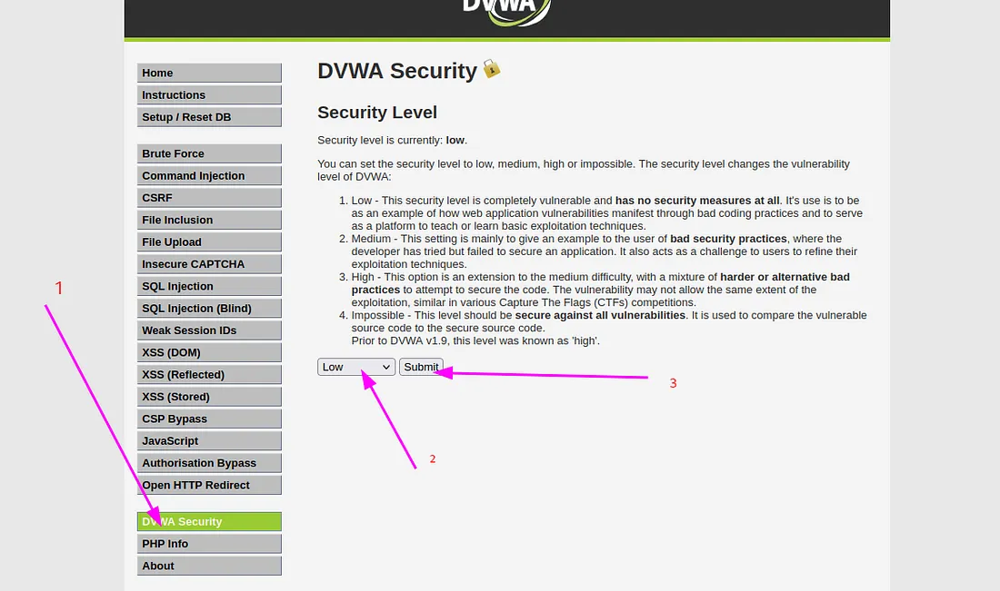
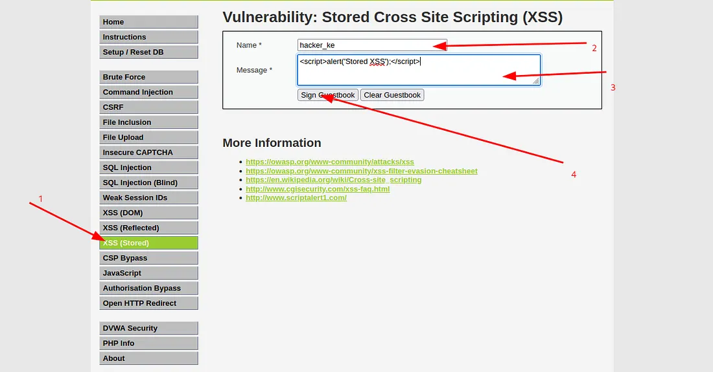
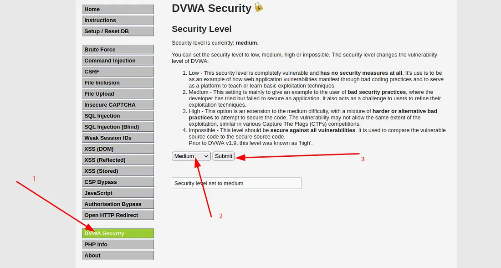
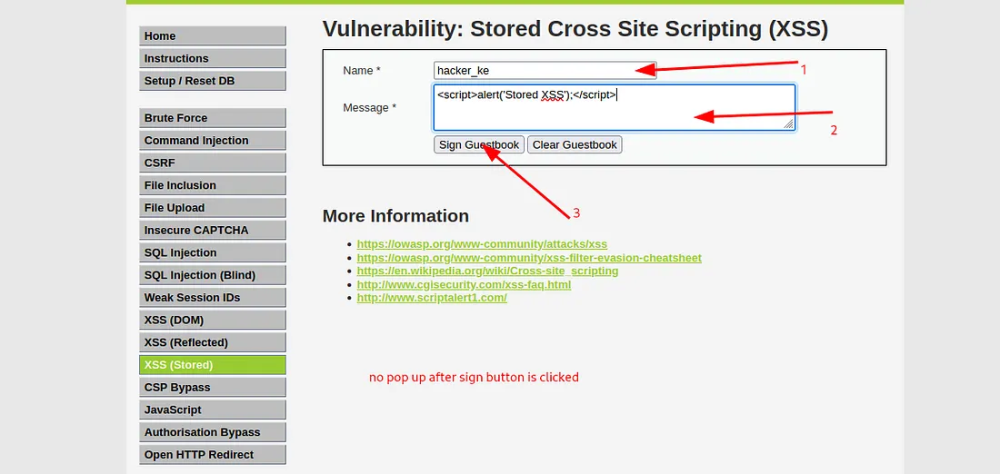
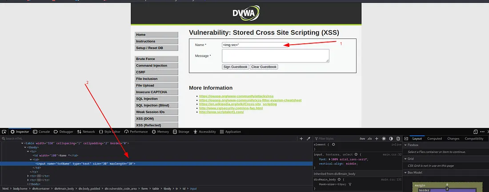
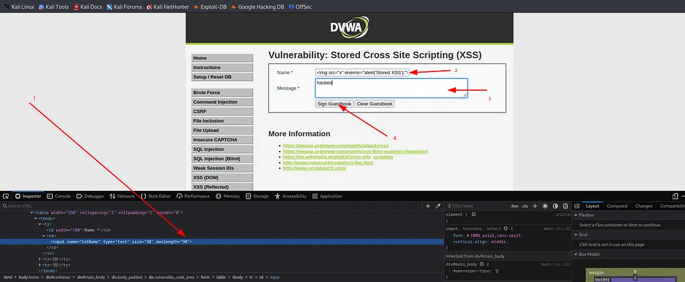
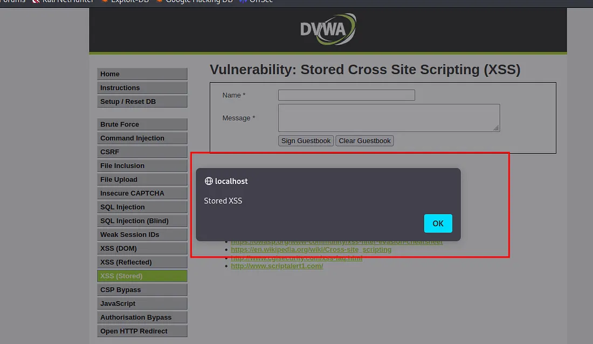
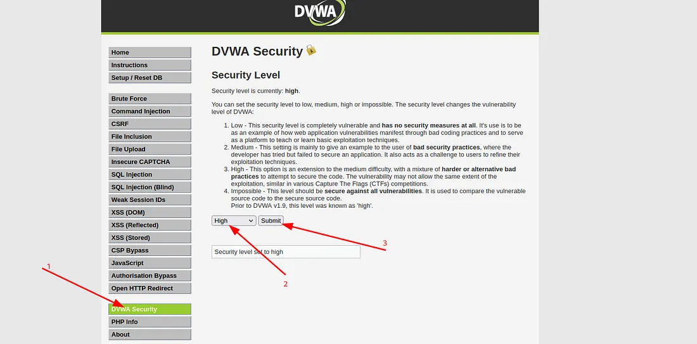
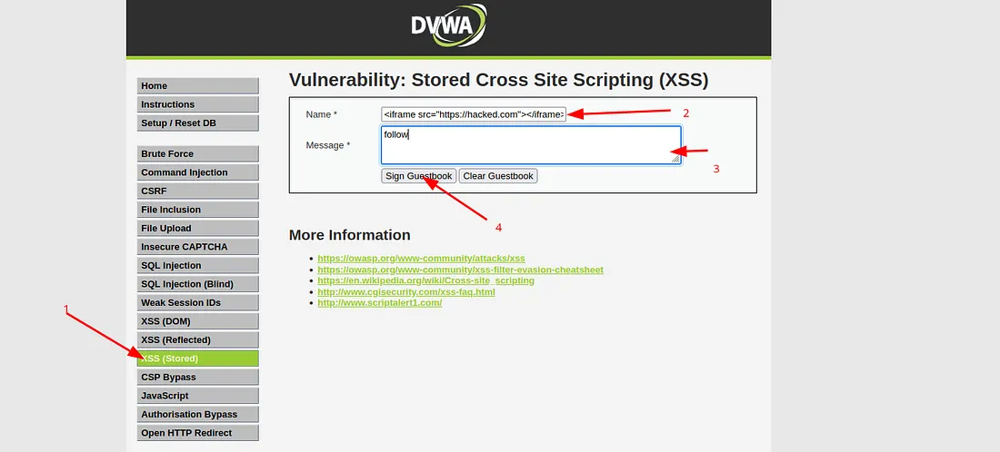
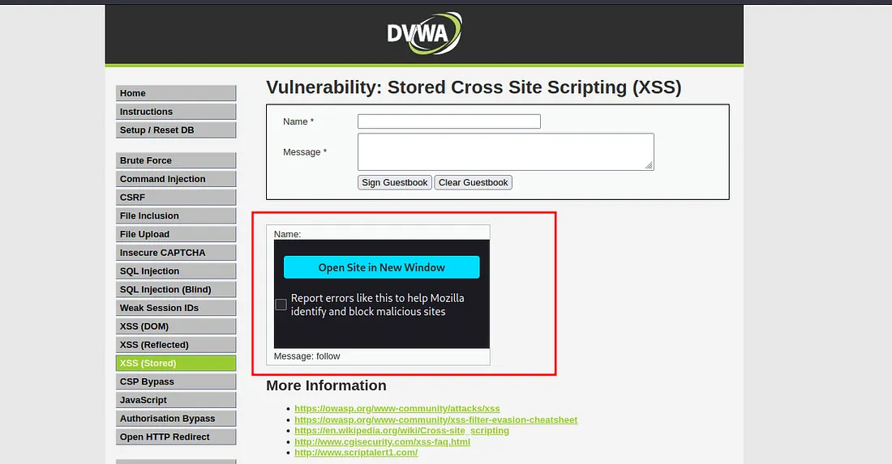

# Stored XSS

This vulnerability occurs when an insecure web application accepts input from untrusted sources, stores it, and later incorporates this harmful content into its HTTP responses.
## DVWA Login and Security Levels

Log in to DVWA using either the default credentials **admin** and **password**, or the credentials you have set up.

We will begin by testing the **low-security level**, then move on to the **medium level**, and finally, the **high-security level**.

## Low Security

Click on **DVWA Security**, then choose the **Low** security level and proceed by clicking the **Submit** button.
   
 Navigate to **XSS (Stored)** and input a name of your choice into the designated field.
 In the **Message** field, insert the payload below, then click **Sign Guestbook**.
  
 Upon submission, an alert box appears, confirming the vulnerability of the site to **stored XSS attacks**.
  
 ## Medium Security

 Click on **DVWA Security**, then choose the **Medium** security level and proceed by clicking the **Submit** button.
  

 Upon re-entering the previous inputs, it becomes evident that no pop-up is triggered, even though the XSS payload is correct. This behavior may be due to input sanitization implemented in the source code, such as:
   - Removal of special characters
   - Filtering of HTML tags
   - Other server-side or client-side security measures  

   Without access to the source code, the exact mechanisms can only be inferred.

### Initial Payload Attempt

<script>alert('stored XSS');</script>
 

It was observed that the `<script>` and `</script>` tags were removed. As a result, payloads relying on these tags cannot be effectively used.

To bypass this restriction and inject a payload into the **Name** field, a payload that does not rely on the `<script>` tag can be used.

```html

```

I attempted to input the payload into the name field, but encountered client-side restrictions that limit users to entering a maximum of 10 characters, as shown below.
 

To bypass this limitation, right-click on the name input field, select **Inspect**, and then modify the `maxlength="10"` attribute to a different value, such as `"90"`. After making this adjustment, press **Enter** to apply the changes.

```html

```
 
Now, input the payload into the name field and enter any text in the message field. Afterward, click on the submit button.
 
After clicking the **Sign Guestbook** button to inject the payload, we received a pop-up alert, which confirms the successful exploitation of this vulnerability at the **medium security level**.
# High Level

Click on **“DVWA Security,”** then choose the **“high” security level** and proceed by clicking the **“Submit”** button as shown below.
 
Since the field has been sanitized to exclude special characters, our payload, which does not include the `<script>` tag, can still be effective. Let’s proceed by injecting the payload into the **name field** and entering arbitrary text into the **message field**. Afterward, submit the form to observe the outcome.

```html
<iframe src="https//:hacked.com"></iframe>
```
 
I utilized the `<iframe>` tag, which is employed to embed one web page within another web page.
 
Based on the obtained results, it is evident that the webpage has indeed been successfully embedded. If a user clicks on the link, they will be directed to the webpage specified in the script. This outcome unequivocally confirms the successful exploitation of this vulnerability at high security level.


